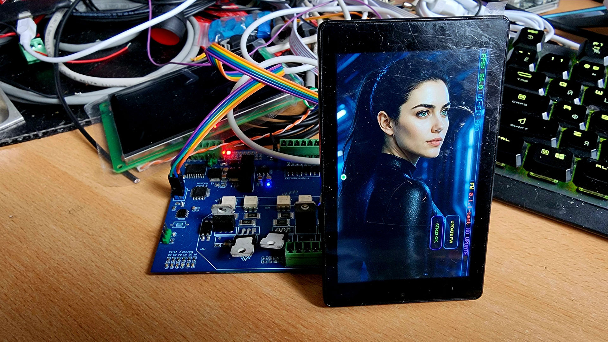

# mad-esp32p4_ass-pain_edition

Author: [madmentat.ru](https://madmentat.ru)

Working template for ESP32-P4 + JC4880P443C with OTA firmware updates and a built-in STM32 SWD programmer.

Firmware for ESP32-P4 that turns the JC4880P443C display module (480x800 MIPI-DSI, ST7701, GT911 capacitive touch) into a full IoT platform with an MMI interface backed by background images, over-the-air firmware updates, and in-system programming of the onboard STM32 co-processor. **The screen never blinks during any OTA operation.**



---

## Features

- **OTA updates** — firmware updates without screen flickering
- **STM32 SWD programmer** — program the STM32 co-processor wirelessly
- **EEZ LVGL UI** — MMI interface with background images
- **MIPI-DSI display** — ST7701, 480x800, 2 data lanes
- **Capacitive touch** — GT911 via I2C
- **WiFi** — via ESP32-C6 co-processor (ESP-Hosted)
- **Multiple WiFi backends** — AT commands, Service, Hosted (SDIO)

---

## Hardware

| Parameter | Value |
|-----------|-------|
| MCU | ESP32-P4 |
| Display module | JC4880P443C (AliExpress) |
| Display controller | ST7701 |
| Resolution | 480 × 800 portrait |
| Display interface | MIPI-DSI, 2 data lanes |
| Touch controller | GT911 capacitive, I2C |
| Flash | 16 MB |
| PSRAM | Required (SPIRAM) |

### Pin Assignments

#### Display (MIPI-DSI + backlight)

| Signal | GPIO | Purpose |
|--------|------|---------|
| LCD reset | 5 | Resets the ST7701 controller during init |
| Backlight PWM | 23 | Controls display backlight brightness via PWM |
| MIPI PHY LDO | channel 3, 2500 mV | Powers the MIPI-DSI PHY layer (internal ESP32-P4 LDO, not a GPIO) |

> MIPI-DSI data (DPI-clk, D0–D3, CKE, CS, DE, HSYNC, VSYNC) goes through the ESP32-P4 internal bus — no separate GPIO assignment is needed.

#### Touchscreen (GT911, I2C)

| Signal | GPIO | Purpose |
|--------|------|---------|
| Touch SDA | 7 | I2C data line (bidirectional) |
| Touch SCL | 8 | I2C clock line |
| Touch RST | 22 | Hardware reset for GT911 (active LOW) |
| Touch INT | 21 | Touch interrupt from GT911 (fires on touch event) |

> GT911 I2C address depends on INT state at reset: INT LOW → `0x5D` (default), INT HIGH → `0x14`.

#### STM32 SWD Programmer

| Signal | GPIO | Purpose |
|--------|------|---------|
| SWCLK | 31 | SWD clock (pull-up to VDD 4.7–10k required) |
| SWDIO | 33 | SWD data (bidirectional, pull-up to VDD 4.7–10k required) |
| NRST | 29 | Target STM32 reset (pull-up to VDD 10k required) |

> All three lines require pull-ups on the target board (STM32 side). Without them, SWD transactions will be unstable.

---

## Project Structure

```
mad-esp32p4_ass-pain_edition/
├── components/
│   └── jc4880p443c/              ST7701 init sequence + timing constants
│       ├── jc4880p443c.c         Validated init commands (39 commands)
│       ├── jc4880p443c.h         Public API
│       └── idf_component.yml
├── main/
│   ├── jc4880p443c_demo.c        Entry point: display, touch, LVGL, app_main
│   ├── stm32_swd_programmer.c    SWD programmer for STM32
│   ├── update/update_manager.c   OTA update manager
│   ├── eez_ui_port.c             EEZ LVGL UI port
│   ├── eez_ui_runtime.c          EEZ UI runtime
│   ├── ui_background_direct.c    Background image rendering
│   ├── display_direct_timing.c   Display timing parameters
│   ├── display_experiments.c     Display experiments
│   ├── wifi_manager*.c           WiFi backends (AT/Service/Hosted/Stub)
│   ├── src/ui/                   EEZ UI files (images, styles, screens)
│   ├── Kconfig.projbuild         WiFi/OTA config via menuconfig
│   ├── CMakeLists.txt
│   └── idf_component.yml
├── partitions.csv                Partition table (16 MB)
├── partitions_ota_16mb.csv       Partition table with OTA
├── sdkconfig                     Current configuration
├── sdkconfig.defaults            Default configuration for ESP32-P4
├── setup.ps1                     Interactive WiFi/OTA setup (Windows)
├── setup.sh                      Interactive WiFi/OTA setup (Linux/macOS)
└── README.md
```

---

## Requirements

- **ESP-IDF 5.5.x** — uses the `i2c_master` driver API from IDF 5.x
- **Python 3.8+** (for IDF tools)

Auto-fetched by IDF Component Manager:

| Component | Version |
|-----------|---------|
| `lvgl/lvgl` | ^9.0.0 |
| `espressif/esp_lcd_st7701` | ^2.0.2 |
| `espressif/esp_lcd_touch` | ^1.1.0 |
| `espressif/esp_lcd_touch_gt911` | ^1.1.0 |
| `espressif/esp_wifi_remote` | >=0.10,<2.0 |
| `espressif/esp_hosted` | ~2 |

> **Note on WiFi:** The ESP32-P4 has no built-in WiFi. It uses an external ESP32-C6 co-processor via `esp_wifi_remote` and `esp_hosted`.

---

## Quick Start

### 1. Clone

```bash
git clone https://github.com/madmentat/mad-esp32p4_ass-pain_edition.git
cd mad-esp32p4_ass-pain_edition
```

### 2. Set target

```bash
idf.py set-target esp32p4
```

### 3. Configure

```bash
idf.py menuconfig
```

Set up WiFi and connection backend.

### 4. Build and flash

```bash
idf.py -p COM3 build flash monitor
```

---

## Setup Script

Interactive script for quick WiFi and OTA SSID configuration in `sdkconfig`:

```bash
# Windows (PowerShell):
powershell -ExecutionPolicy Bypass -File setup.ps1

# Linux / macOS:
bash setup.sh
```

The script will ask for:
1. **WiFi SSID** and password
2. **OTA local SSID** — WiFi network SSID for OTA updates — can be skipped

If `sdkconfig` already contains real values (not placeholders), the script will offer to overwrite.

> **Note:** `setup.sh` requires GNU grep (`grep -oP`). It does not work out of the box on macOS — install GNU grep via `brew install grep`.

---

## WiFi Backends

The project supports multiple ways to connect the ESP32-C6:

| Backend | Description |
|---------|-------------|
| ESP32-C6 AT | AT commands via UART |
| ESP32-C6 Service | Service mode |
| ESP32-C6 Hosted | SDIO/SPI Hosted (recommended) |
| Stub | Stub for testing without WiFi |

Select via `idf.py menuconfig` → Dashboard WiFi Backend.

---

## OTA Updates

The project uses the **madUpdate** protocol — an HTTP REST API for remote firmware updates of ESP32-P4 and the STM32 co-processor. **The screen never blinks during any OTA operation.**

### Update Server Configuration

OTA server parameters are configured via `idf.py menuconfig` → **madUpdate OTA Client**:

| Parameter | Default | Description |
|-----------|---------|-------------|
| `MAD_OTA_ENABLE` | y | Enable OTA client |
| `MAD_OTA_AUTO_CHECK` | n | Auto-check for updates on boot |
| `MAD_OTA_AUTO_INSTALL` | n | Auto-install updates |
| `MAD_OTA_USE_LOCAL_SERVER` | n | Use local server instead of public |
| `MAD_OTA_LOCAL_BASE_URL` | `http://192.168.88.17:8090` | Local API server URL |
| `MAD_OTA_PUBLIC_BASE_URL` | `https://test.ard-s.ru` | Public API server URL |
| `MAD_OTA_LOCAL_FIRMWARE_BASE_URL` | `http://192.168.88.17/firmware` | Firmware download base URL (local) |
| `MAD_OTA_PUBLIC_FIRMWARE_BASE_URL` | `https://test.ard-s.ru` | Firmware download base URL (public) |
| `MAD_OTA_LOCAL_SSID` | `ARD` | WiFi SSID that triggers local server |
| `MAD_OTA_APP_VERSION` | `0.1.1-test` | Current ESP32-P4 firmware version |
| `MAD_OTA_PRODUCT_ID` | `jc4880p443c_demo` | Product identifier |
| `MAD_OTA_HW_REV` | `jc4880p443c-p4-c6-v1` | Hardware revision |
| `MAD_OTA_CHANNEL` | `test` | Update channel (test / stable) |

### Communication Protocol

The device communicates with the server via 4 endpoints:

```
POST /api/v1/update/check     — check for available updates
POST /api/v1/update/start     — begin update installation
POST /api/v1/update/progress  — report installation progress
POST /api/v1/update/report    — report installation result
```

#### 1. Check — update availability

The device sends a POST request with JSON body:

```json
{
  "device_uid": "AABBCCDD11223344",
  "product_id": "jc4880p443c_demo",
  "hw_rev": "jc4880p443c-p4-c6-v1",
  "channel": "test",
  "idf_app_version": "0.1.1-test",
  "versions": {
    "esp32p4": "0.1.1-test",
    "STM32F030K6T6": "4.6"
  }
}
```

The server responds with a JSON manifest (see below) or `{"decision": "NO_UPDATE"}`.

#### 2. Manifest format

The server response contains an array of components — each describes an available update for a specific target device:

```json
{
  "manifest": {
    "product_id": "jc4880p443c_demo",
    "hw_rev": "jc4880p443c-p4-c6-v1",
    "release_id": 42,
    "deployment_id": 7,
    "bundle": {
      "mandatory": false,
      "allow_downgrade": false,
      "auto_update": true,
      "auto_rollback": true
    },
    "components": [
      {
        "target": "esp32p4",
        "version": "0.2.0",
        "relative_url": "/firmware/test/esp32p4_v0.2.0.bin",
        "sha256": "a1b2c3d4e5f6...",
        "size_bytes": 7200000,
        "reboot_required": true,
        "rollback_supported": true
      },
      {
        "target": "STM32F030K6T6",
        "version": "4.7",
        "relative_url": "/firmware/test/stm32f030_v4.7.bin",
        "sha256": "f6e5d4c3b2a1...",
        "size_bytes": 24000,
        "reboot_required": false,
        "rollback_supported": false
      }
    ]
  }
}
```

Component fields:

| Field | Required | Description |
|-------|----------|-------------|
| `target` | yes | Target device: `esp32p4` or `STM32F030K6T6` |
| `version` | yes | Firmware version |
| `relative_url` | yes | Path to firmware file (relative to firmware_base_url) |
| `sha256` | yes | SHA-256 hash for integrity verification |
| `size_bytes` | no | File size in bytes |
| `reboot_required` | no | Reboot needed after install (default: true) |
| `rollback_supported` | no | Rollback supported (default: true) |
| `mandatory` | no | Force installation |
| `allow_downgrade` | no | Allow version downgrade |

#### 3. Progress — installation progress

During firmware download and write, the device periodically sends:

```json
{
  "device_uid": "AABBCCDD11223344",
  "target": "esp32p4",
  "percent": 45,
  "bytes_written": 3240000,
  "bytes_total": 7200000
}
```

#### 4. Report — installation result

After installation completes:

```json
{
  "device_uid": "AABBCCDD11223344",
  "target": "esp32p4",
  "status": "success",
  "installed_version": "0.2.0",
  "reboot_required": true
}
```

### Static Manifest (fallback)

If the server is unavailable, the device can download a manifest from a fixed path:

```
GET /firmware/test/manifest_p4_ota_test.json
```

Enable via `MAD_OTA_TRY_STATIC_MANIFEST_FALLBACK=y`.

### Configuration via menuconfig

```
idf.py menuconfig
  └── madUpdate OTA Client
        ├── Enable OTA (y/n)
        ├── Auto-check on boot (y/n)
        ├── Auto-install (y/n)
        ├── Use local server (y/n)
        ├── Local base URL (default: http://192.168.88.17:8090)
        ├── Public base URL (default: https://test.ard-s.ru)
        ├── Local firmware base URL (default: http://192.168.88.17/firmware)
        ├── Public firmware base URL (default: https://test.ard-s.ru)
        ├── OTA local SSID (default: ARD)
        ├── App version (default: 0.1.1-test)
        ├── Product ID (default: jc4880p443c_demo)
        ├── HW revision (default: jc4880p443c-p4-c6-v1)
        └── Channel (default: test)
```

---

## STM32 SWD Programmer

The project includes a software SWD master (`stm32_swd_programmer.c`) implemented on ESP32-P4 via GPIO bit-banging. It programs the onboard STM32F030 co-processor wirelessly — no external programmer or physical access to the board required.

### SWD GPIO Assignments

| Signal | Default GPIO | Description |
|--------|--------------|-------------|
| NRST | GPIO 29 | Target STM32 reset |
| SWDIO | GPIO 33 | SWD data (bidirectional) |
| SWCLK | GPIO 31 | SWD clock |

GPIO assignments are configurable via `idf.py menuconfig` → **STM32F030 SWD Programmer**.

### Pull-up / Pull-down Requirements

For a stable SWD link, the following pull-ups **must be present on the target side** (STM32 board):

| Line | Requirement | Explanation |
|------|-------------|-------------|
| **SWCLK** | Pull-up to VDD (4.7k – 10k) | Clock line must be HIGH by default. Without a pull-up, ESP32-P4 may interpret noise as clock edges, corrupting SWD transactions |
| **SWDIO** | Pull-up to VDD (4.7k – 10k) | Data line idle state must be HIGH (read mode). Without a pull-up, ACK bits become unstable |
| **NRST** | Pull-up to VDD (10k) | Reset must be inactive (HIGH) during SWD operation. Without a pull-up, STM32 may spontaneously enter reset |

> **Important:** These pull-ups must be on the target board (STM32) side, not on the ESP32-P4 side. Most debug probes (ST-Link, J-Link) have built-in pull-ups — when programming via our SWD master, you must provide them externally.

### How It Works

The programmer implements a full CMSIS-DAP stack via bit-banging:

1. **SWD line reset** — 50+ clock cycles with SWDIO=LOW to reset SWD state machine
2. **DP IDCODE read** — reads the debug port identifier (Cortex-M0: `0x0BC11477`)
3. **Debug port power-up** — requests CTRL/STAT with `CSYSPWRUPREQ` and `CDBGPWRUPREQ` bits
4. **AP ID read** — reads MEM-AP IDR to determine memory access type
5. **Flash programming** — unlock → page erase → half-word program → verify → SYSRESETREQ

The protocol conforms to the **ARM Debug Interface Architecture Specification (ADIv5.2)**:

- [ARM ADIv5.2 Specification (ARM IHI 0031)](https://developer.arm.com/documentation/ihi0031/latest/)
- [ARM Cortex-M0 Technical Reference Manual](https://developer.arm.com/documentation/ddi0419/latest/)
- [ARM SWD (Serial Wire Debug) Protocol](https://developer.arm.com/documentation/ddi0314/h/Serial-Wire-Debug--SWD--interface)

### Configuration via menuconfig

```
idf.py menuconfig
  └── STM32F030 SWD Programmer
        ├── Enable software SWD programmer for STM32F030 (y/n)
        ├── STM32 NRST GPIO (default: 29)
        ├── STM32 SWDIO GPIO (default: 33)
        ├── STM32 SWCLK GPIO (default: 31)
        ├── SWD bit half-period delay, us (default: 2)
        └── SWD probe task CPU core (default: 0)
```

---

## EEZ Studio Integration

This project is compatible with [EEZ Studio](https://eez-studio.com/) — a visual LVGL UI editor. The entire MMI interface (screens, styles, images, widgets) is generated by EEZ Studio and placed in the `main/src/ui/` folder.

### Importing a UI from EEZ Studio

1. Open your project in EEZ Studio
2. Export the LVGL project (File → Export → LVGL)
3. Copy the `src/` folder from the exported project into `main/` of this repository, replacing the existing one:

```bash
# From the EEZ Studio export directory:
cp -r ./exported_project/src/ ./main/src/
```

4. Rebuild the project:

```bash
idf.py build
```

The EEZ UI port (`eez_ui_port.c`, `eez_ui_runtime.c`) provides compatibility between the EEZ-generated code and the ESP-IDF runtime. The `main/src/ui/` files contain:
- `ui.c / ui.h` — UI initialization, screen creation
- `screens.c / screens.h` — screen definitions
- `styles.c / styles.h` — widget styles
- `images.c / images.h` — LVGL image wrappers
- `ui_image_*.c` — image data arrays (encoded as C)

> **Tip:** When importing a new UI from EEZ Studio, make sure the LVGL version in EEZ Studio matches the project version (^9.0.0). LVGL 8.x vs 9.x incompatibilities will break the build.

---

## License

MIT. Do whatever you like with it.
